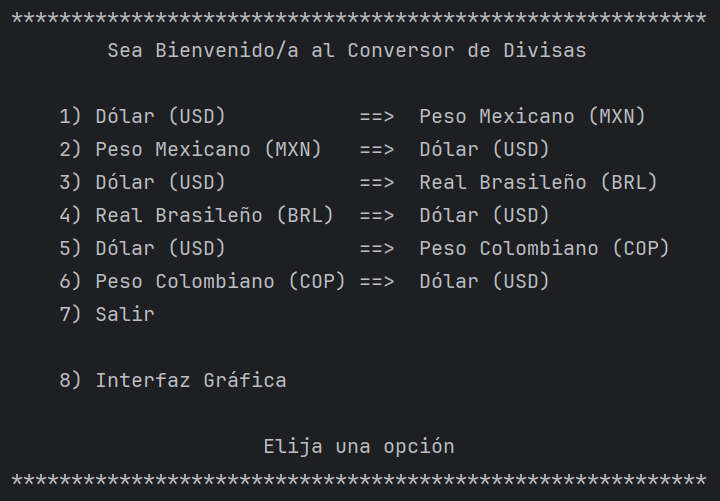
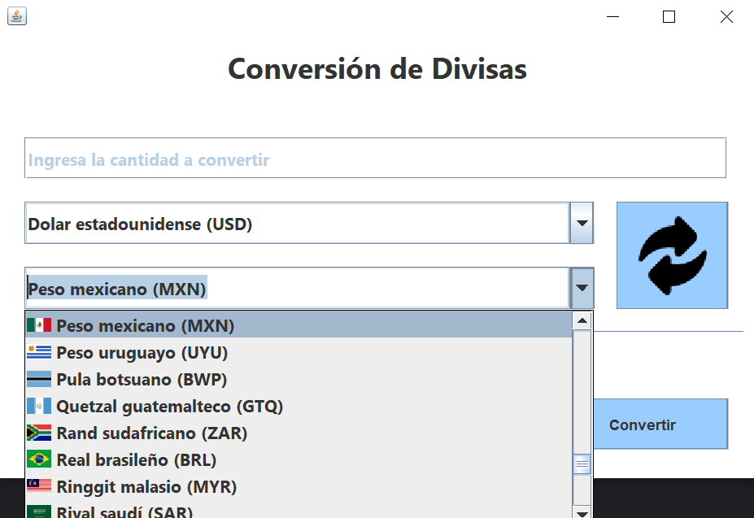

# Conversor de Divisas
---

El Conversor de Divisas brinda a los usuarios la capacidad de seleccionar una moneda de origen y una moneda de destino, ingresar el valor que desean convertir y obtener instantáneamente el valor convertido en la moneda deseada. Al aprovechar las tasas de cambio actualizadas proporcionadas por una API externa, la aplicación garantiza la precisión de las conversiones en tiempo real.

## Interfaz de Usuario
---

  

  

## Funcionamiento
---
1. **Selección de Monedas**: Los usuarios pueden elegir fácilmente la moneda de origen y la moneda de destino de una lista de opciones disponibles.

2. **Ingreso de Valor**: Simplemente ingresan el valor que desean convertir en la moneda de origen.

3. **Obtención del Resultado**: La aplicación realiza una solicitud a la API de tasas de cambio utilizando las monedas seleccionadas y el valor ingresado. Luego, calcula el valor convertido utilizando las tasas de cambio proporcionadas por la API.

4. **Visualización del Resultado**: El valor convertido se muestra de forma clara y legible en la interfaz de usuario, lo que permite a los usuarios ver el resultado de la conversión de manera rápida y sencilla.

## ¡Experimenta la Facilidad de Convertir Monedas!
---
Con el Conversor de Monedas, realizar conversiones de moneda nunca ha sido tan simple y conveniente. Descubre la comodidad de convertir monedas con esta aplicación Java y disfruta de una herramienta intuitiva que te brinda acceso instantáneo a las tasas de cambio actualizadas.

  

